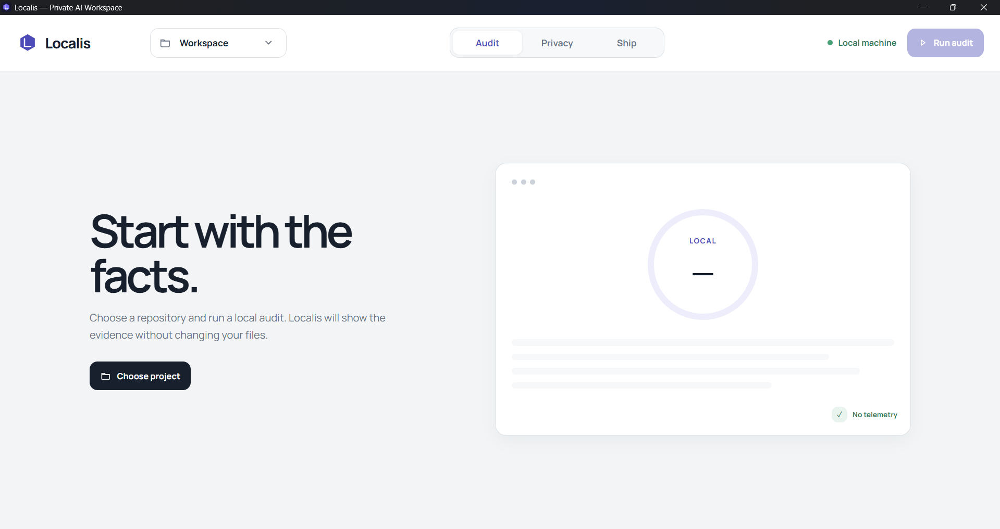
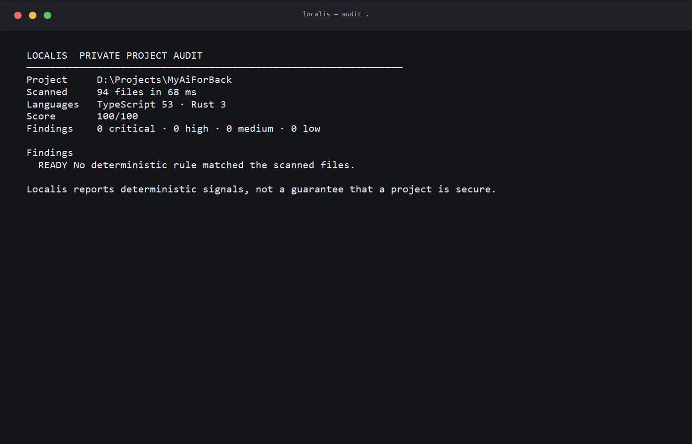

<div align="center">
  

  # Localis

  **Private by default. Useful by design.**

  Local-first code audits, deliberate AI context, reviewable changes, and release checks.

  [Website](https://localis.dev) · [Documentation](https://localis.dev/docs) · [Releases](https://github.com/KebiLab/Localis/releases) · [Security](SECURITY.md)

  [](https://github.com/KebiLab/Localis/actions/workflows/ci.yml)
  [](https://github.com/KebiLab/Localis/releases)
  [](https://www.npmjs.com/package/localis)
  [](LICENSE)
</div>

---

## What Localis does

Localis starts without a model. It scans a repository locally, reports deterministic evidence, and makes every network boundary explicit. Connect Ollama, LM Studio, OpenAI, OpenRouter, or another OpenAI-compatible API only when a task needs a model.

| Workflow | What you get |
| --- | --- |
| `localis audit` | Local findings with file, line, rule, severity, and remediation |
| `localis privacy` | Selected files, redaction counts, endpoint, and payload SHA-256 |
| `localis ask` | Project-aware answers using only approved context |
| `localis propose` / `fix` | Schema-constrained change plans that cannot write by themselves |
| `localis apply` / `undo` | Diff preview, hash checks, private backups, and conflict-safe restore |
| `localis test` / `ship` | Test discovery and one release-readiness decision |

## Real interfaces

These captures come from Localis 0.2.0, not a product mockup.

<p align="center">
  
</p>

<p align="center">
  
</p>

## Install

Localis requires Node.js 20.9 or newer.

### npm

```bash
npm install --global localis
localis doctor
```

### Bun

```bash
bun add --global localis
localis doctor
```

### Run once

```bash
npx localis audit .
```

### curl · macOS and Linux

```bash
curl -fsSL https://raw.githubusercontent.com/KebiLab/Localis/main/scripts/install.sh | sh
```

### PowerShell · Windows

```powershell
irm https://raw.githubusercontent.com/KebiLab/Localis/main/scripts/install.ps1 | iex
```

### Desktop application

Download the Windows, macOS, or Linux installer from [GitHub Releases](https://github.com/KebiLab/Localis/releases). The first public builds are unsigned previews, so the operating system may show a warning.

After the first Windows installer is accepted into the WinGet community repository, installation will be:

```powershell
winget install KebiLab.Localis
```

## First audit

```bash
cd your-repository
localis audit .
localis privacy . --file src --file package.json
localis ship .
```

Machine-readable output is available for automation:

```bash
localis audit . --json
localis ship . --json
```

## Add AI deliberately

Ollama is the default local provider. LM Studio is restricted to loopback endpoints as well.

```bash
localis models
localis ask "Explain the authentication flow" . --file src/auth
```

For an OpenAI-compatible API, keep the key in an environment variable:

```powershell
$env:OPENAI_API_KEY = "your-key"
localis models --provider openai-compatible `
  --endpoint https://api.openai.com/v1 `
  --api-key-env OPENAI_API_KEY
```

Use `--dry-run` to inspect the exact manifest and payload hash without contacting a provider.

## Safety model

- Deterministic audits do not need a model or network connection.
- Remote provider URLs must use HTTPS; local providers must use loopback.
- API keys are read from an environment variable or held in desktop memory for the current session.
- AI output becomes a validated plan, never an implicit file write.
- `apply` previews the diff, verifies original SHA-256 values, and requires confirmation.
- Backups live under the ignored `.localis/` directory and `undo` refuses unsafe overwrites.

See [Privacy](docs/PRIVACY.md), [Change plans](docs/CHANGE_PLANS.md), and [Security policy](SECURITY.md).

## Repository map

```text
apps/
  cli/       published as `localis`
  desktop/   Tauri 2 + React desktop application
  web/       Next.js website and documentation
packages/
  core/      published as `localis-core`
docs/        architecture, privacy, release, and change-plan details
scripts/     curl, PowerShell, and WinGet release helpers
```

## Development

```bash
npm install
npm test
npm run typecheck
npm run build
```

Start the website with `npm run dev:web`. Native desktop development additionally needs Rust and the [Tauri prerequisites](https://v2.tauri.app/start/prerequisites/), then runs with `npm run dev:desktop`.

## Release status

Localis 0.2.0 is a public preview. The deterministic scanner, privacy gateway, provider discovery, change plans, apply/undo, test discovery, ship gate, desktop app, and CLI are implemented. Code signing, WinGet approval, and editor integrations follow the first public installer feedback.

Read [CONTRIBUTING.md](CONTRIBUTING.md) before opening a pull request. Security reports belong in the private process described in [SECURITY.md](SECURITY.md).

## Credits

Made by **KebiLab**.

Localis was inspired in part by the open-source work and ideas shared by [Andrew-py-dew](https://github.com/Andrew-py-dew). Localis is an independent implementation and does not include that repository's source code.

Licensed under the [Apache License 2.0](LICENSE). Copyright © 2026 KebiLab.
